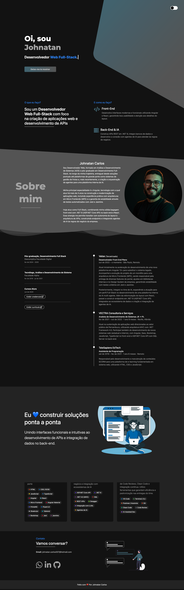

# Portfólio — Johnatan Carlos

Portfólio pessoal desenvolvido com HTML, CSS e JavaScript puro. Apresenta minha trajetória profissional, skills técnicas e formas de contato.



## Seções

- **Home** — apresentação com animação de texto via Typed.js
- **O que eu faço?** — visão geral da atuação como Dev Full-Stack
- **Sobre mim** — bio e trajetória profissional
- **Experiência** — formação acadêmica e histórico de empresas
- **Skills** — stack técnica (Front-End, Back-End & IA, Ferramentas)
- **Contato** — links para WhatsApp, LinkedIn e GitHub

## Tecnologias

| Categoria | Tecnologias |
|---|---|
| Markup & Estilo | HTML5, CSS3, Bootstrap 4 |
| Scripts | JavaScript, jQuery 3.5 |
| Bibliotecas | Typed.js, Font Awesome 5 |
| Animações | CSS custom + scroll listener |

## Como rodar

Sem dependências ou build step. Basta abrir o arquivo diretamente no navegador:

```bash
# clone o repositório
git clone https://github.com/JohnatanCarlos/johnatan.git

# abra no navegador
open index.html
```